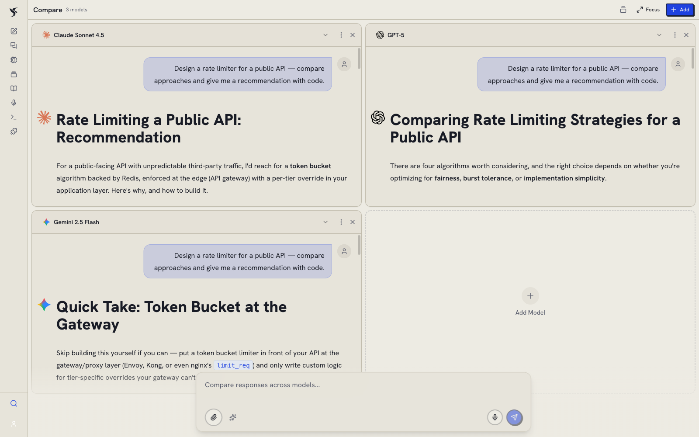
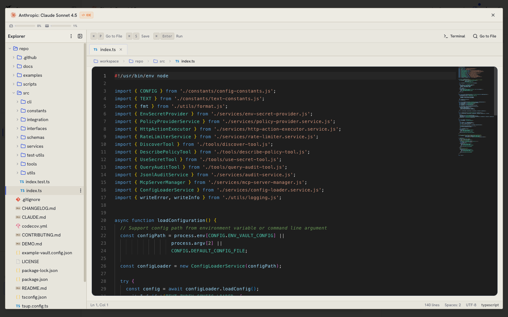
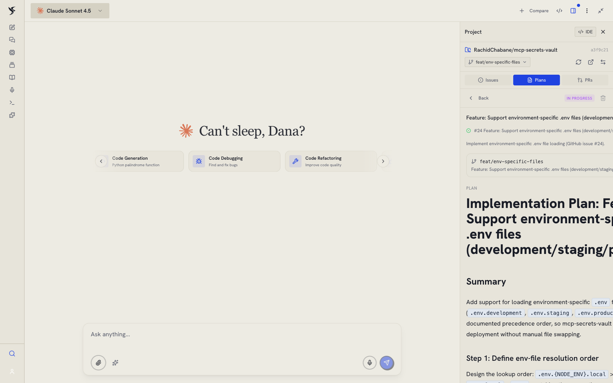
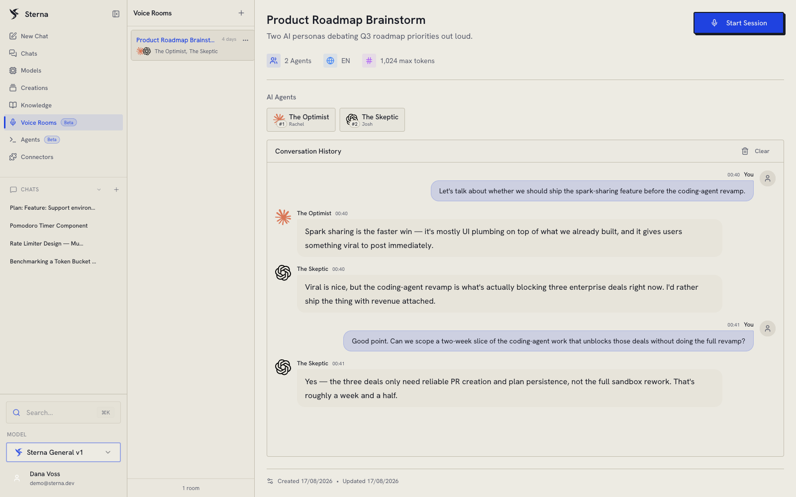
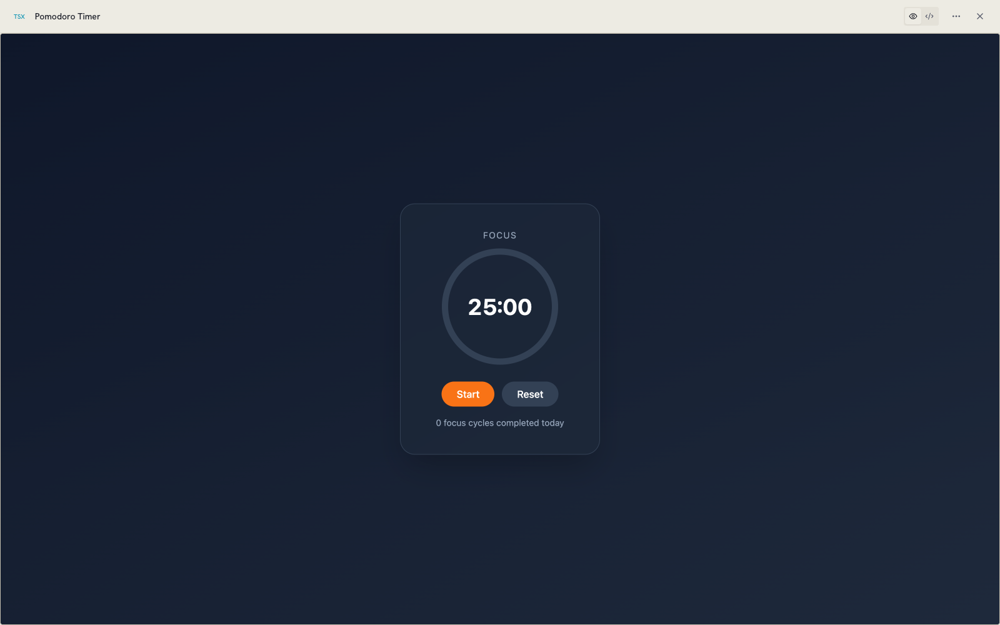
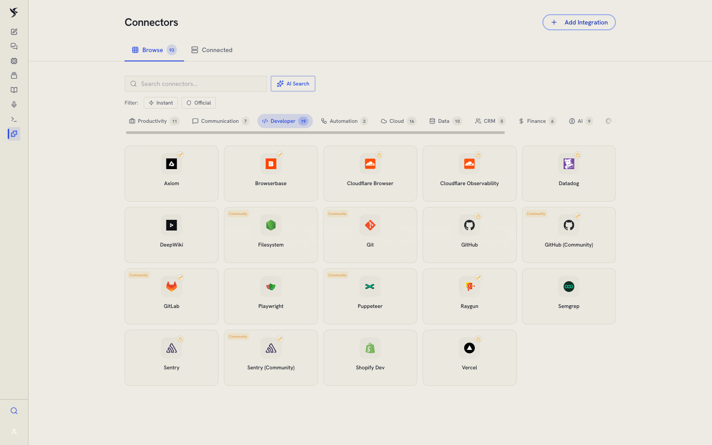
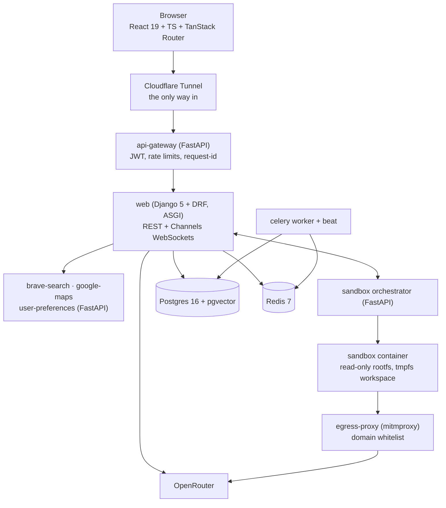

<h1 align="center">Sterna</h1>

<p align="center">An accountable multi-model AI workspace.</p>

<p align="center">
  <a href="https://github.com/RachidChabane/sterna/actions/workflows/ci.yml"></a>
  <a href="LICENSE"></a>
  
  
  
</p>

---

Sterna runs many language models in one workspace and keeps a receipt for every
one of them. Chat with several models side by side, hand a GitHub issue to a
coding agent that plans and implements it inside a locked-down container, hold a
live voice conversation with a room of AI agents, ground answers in your own
documents, and generate runnable mini-apps you can deploy in a click. Under all
of it sits a single billing service: every model call, tool call, image, video
second and agent turn is priced, attributed to a user, checked against a quota
before it runs, and settled server-side even when the browser tab closes. This
is a full-stack system rather than a wrapper around one API: Django and Celery,
FastAPI microservices, a React SPA, a Docker sandbox, Postgres with pgvector,
and Kubernetes and Terraform for the infrastructure.

## Highlights

- **Multi-model side-by-side chat.** Run several models in parallel columns,
  each chat with its own model and parameters, streaming with tool use and
  markdown/mermaid rendering. Every message records the model that actually
  produced it, with its tokens, cost and latency.
  <sub>`core/frontend/src/components/models/ChatGrid.tsx`</sub>
- **Coding agent with a real IDE.** An autonomous agent works inside a sandboxed
  container while the browser renders a Monaco IDE over its workspace: file
  tree, tabs, diff viewer, global search, commit history, live execution output.
  <sub>`core/frontend/src/components/sandbox/`, `core/sandbox/orchestrator/`</sub>
- **GitHub issue → plan → implement → PR.** Clone a repository, list its open
  issues, have the agent explore in read-only plan mode, review the plan it
  wrote, then approve it and let it implement and open the pull request.
  <sub>`core/code_sessions/`, `core/llm/langchain_file_tools.py`</sub>
- **Real-time multi-agent voice rooms.** Several AI agents with distinct models
  and voices join a live room alongside you: Deepgram streaming STT, an LLM
  router deciding who answers, ElevenLabs or OpenAI TTS back out, all over
  Django Channels WebSockets.
  <sub>`core/voice_rooms/services/`</sub>
- **MCP connectors** (beta). Browse preconfigured Model Context Protocol servers
  or add your own, connect them through OAuth, and approve tool calls before they
  run.
  <sub>`core/mcp/`, `core/frontend/src/components/mcp/`</sub>
- **Sparks.** The model can produce runnable interactive mini-apps rendered live
  in the chat, with an auto-fix loop when they break and one-click deploy (the
  deploy step is beta).
  <sub>`core/sparks/`, `core/frontend/src/components/sparks/`</sub>
- **30+ built-in tools.** Web, news, image and video search; the full Google Maps
  suite; code execution and file operations; image generation and video
  generation (video providers are beta); knowledge-base retrieval. All callable
  mid-conversation, each rendered with a purpose-built component instead of raw
  JSON.
  <sub>`core/llm/tool_catalog/core_tools.py`</sub>
- **Automatic model routing.** The "Auto" model scores each message with cheap
  heuristics, falls back to an LLM classifier when the score is ambiguous,
  tracks conversation complexity over time, and picks a model from a capability
  pool, then reroutes mid-stream when a provider rate-limits.
  <sub>`core/llm/smart_router/`</sub>
- **Personal knowledge base.** Drag in documents, watch them chunk and embed
  into pgvector, then query them from any chat.
  <sub>`core/knowledge_base/`</sub>
- **Cost tracking that does not leak.** One `BillingService` prices every
  billable operation against a central table, checks quota before the call, and
  writes an append-only `UsageLog`. Aborted streams are settled server-side
  against the provider's real cost; client-supplied costs are clamped. The
  sandboxed agent's own spend is parsed from its output stream and folded back
  in, so both LLM layers are billed.
  <sub>`core/usage_quota/billing/service.py`</sub>
- **Bring your own key.** Plug in keys for OpenAI, Anthropic, Google, Mistral,
  DeepSeek or xAI, or fall back to platform provisioning. Every usage row is
  tagged `platform` or `byok`, and a service that can never be BYOK-backed
  raises rather than silently mis-attributing spend.
  <sub>`core/llm/provider_registry.py`, `core/usage_quota/constants.py`</sub>

Also included: custom sub-agents with @-mention autocomplete, a model catalog
with a comparison matrix and cost calculator, an advisor that reads a
conversation and recommends cheaper models for it, a Cmd+K command palette
across every entity, a guided onboarding wizard, Stripe subscriptions with
invoice history, GDPR export and deletion with a grace period, an audit log, and
object-storage backup of user assets.

## Screenshots

<!-- Images land in docs/images/. Slots below are intentionally empty until then. -->

<table>
  <tr>
    <td width="50%">
      <!-- screenshot: multi-model-chat -->
      
      <sub><b>Multi-model chat</b>: one prompt, several models, one view.</sub>
    </td>
    <td width="50%">
      <!-- screenshot: coding-agent-ide -->
      
      <sub><b>Coding agent IDE</b>: file tree, diffs and live agent steps.</sub>
    </td>
  </tr>
  <tr>
    <td width="50%">
      <!-- screenshot: issue-to-pr -->
      
      <sub><b>Issue to PR</b>: plan, review, implement, ship.</sub>
    </td>
    <td width="50%">
      <!-- screenshot: voice-rooms -->
      
      <sub><b>Voice rooms</b>: multiple agents, live transcript.</sub>
    </td>
  </tr>
  <tr>
    <td width="50%">
      <!-- screenshot: sparks -->
      
      <sub><b>Sparks</b>: generated mini-apps, rendered and deployable.</sub>
    </td>
    <td width="50%">
      <!-- screenshot: mcp-connectors -->
      
      <sub><b>MCP connectors</b>: one-click marketplace of 93 preconfigured servers, OAuth included.</sub>
    </td>
  </tr>
</table>

## Architecture at a glance



A Django monolith holds the domain and the WebSockets; FastAPI services carry
the isolated concerns (gateway, search, maps, preferences, sandbox
orchestration); Celery does the deferred work; the coding agent runs in a
container with a read-only root filesystem and whitelist-only egress. Full
detail, including the two-layer coding agent, the billing flow and the honest
scope of the sandbox guarantees: **[docs/architecture.md](docs/architecture.md)**.

## Quickstart

```bash
git clone https://github.com/RachidChabane/sterna.git
cd sterna/core
cp .env.example .env      # fill in at minimum OPENROUTER_API_KEY
make dev                  # frontend, gateway, web, postgres, redis, workers, microservices
make migrate
make seed                 # quota tiers, preconfigured MCP servers
make createsuperuser
```

Frontend on <http://localhost:5173>, API on <http://localhost:8000>, admin at
`/admin`. `make help` lists every target. The coding-agent sandbox is a separate
opt-in compose file; see [`core/README.md`](core/README.md) for that, the
no-Docker path, and the repository layout.

Tests: `make test` (backend, in the container), `pnpm test` and `pnpm typecheck`
in `core/frontend`, Playwright smoke via
`pnpm exec playwright test --project=chromium --grep @smoke`. CI runs lint,
backend, frontend, microservice and smoke suites on every push.

## Tech stack

| Layer | What it is |
|---|---|
| Frontend | React 19, TypeScript 5.8, Vite 7, TanStack Router, Zustand 5, Tailwind, Monaco |
| API | Django 5.2 + Django REST Framework on Uvicorn ASGI, Django Channels for WebSockets |
| Services | FastAPI: api-gateway, sandbox orchestrator, brave-search, google-maps, user-preferences |
| Async | Celery worker + beat, Redis broker, `django_celery_beat` scheduler |
| Data | PostgreSQL 16 with pgvector (HNSW), Redis 7 |
| LLM | OpenRouter for multi-provider routing, LangChain for the agent loop, MCP for external tools |
| Sandbox | Docker containers with read-only rootfs, tmpfs workspace, mitmproxy egress whitelist, gVisor where available |
| Infra | Docker Compose (single host), Kubernetes with kustomize, Terraform for k3s on Hetzner, Cloudflare Tunnel ingress, GitHub Actions CI |

## Documentation

| Document | What it covers |
|---|---|
| [docs/architecture.md](docs/architecture.md) | Service map, request flow, two-layer coding agent, sandbox isolation, billing, data model |
| [docs/self-hosting.md](docs/self-hosting.md) | Clone to running instance: Compose path, Kubernetes path, required external services and keys |
| [core/README.md](core/README.md) | Application layout, development commands, testing |
| [CONTRIBUTING.md](CONTRIBUTING.md) | How to build, test and propose changes |
| [SECURITY.md](SECURITY.md) | Vulnerability disclosure |

## Status

Feature-complete and covered by backend, frontend and end-to-end suites, run on
a staging cluster, and never used by production traffic. Stripe has only ever
operated in test mode; no live payment has been processed. Treat a first
production bring-up as a project, and read the sandbox security note in
[docs/self-hosting.md](docs/self-hosting.md#the-sandbox-profile-read-before-enabling)
before enabling the coding agent on a host you care about.

## License

Apache License 2.0. See [LICENSE](LICENSE) and [NOTICE](NOTICE).
Copyright © Rachid Chabane ([@RachidChabane](https://github.com/RachidChabane)).

Provider names and logos shown in the UI (OpenAI, Anthropic, Google, Mistral,
DeepSeek, xAI, and the other services Sterna can connect to) are trademarks of
their respective owners, used nominatively to identify those services. The icon
assets are vendored from the MIT-licensed
[`@lobehub/icons-static-svg`](https://github.com/lobehub/lobe-icons) package;
attribution is in `core/frontend/src/assets/provider-icons/README.md`. No
affiliation with or endorsement by any of these companies is claimed.
