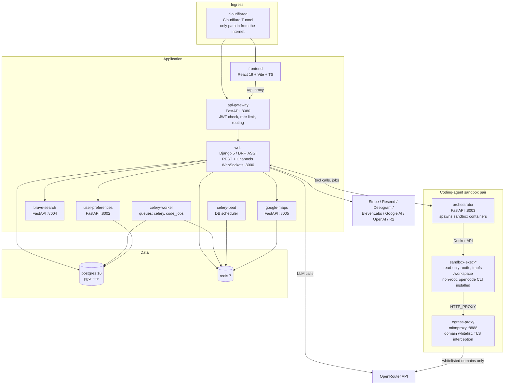
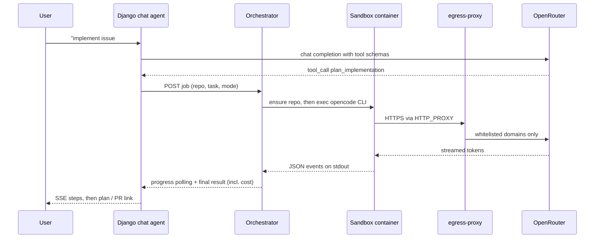
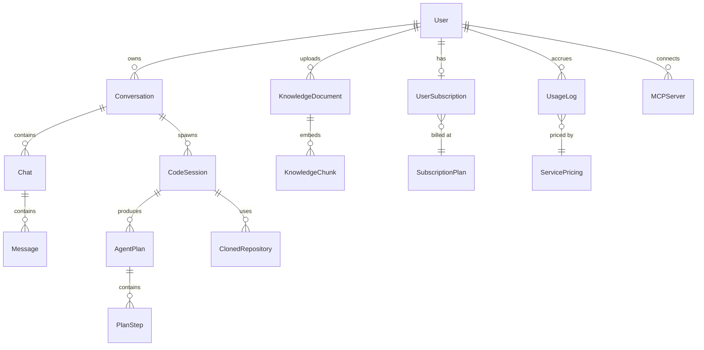

# Architecture

How Sterna is put together, and why. Every statement here is checkable against
the files it names. Primary sources: `core/docker-compose.yml` (dev),
`core/docker-compose.prod.yml` (single-VPS production),
`core/sandbox/docker-compose.sandbox.yml` (sandbox pair),
`infra-migration/kubernetes/base/` (Kubernetes manifests), plus the code cited
inline.

## Contents

- [Service map](#service-map)
- [Request flow](#request-flow)
- [Chat and tool execution](#chat-and-tool-execution)
- [Two-layer coding agent](#two-layer-coding-agent)
- [Sandbox isolation](#sandbox-isolation)
- [Billing and quotas](#billing-and-quotas)
- [Authentication](#authentication)
- [Data model](#data-model)
- [Observability](#observability)
- [Deployment targets](#deployment-targets)

## Service map

Every service below is present in `core/docker-compose.prod.yml`. The
Kubernetes base at `infra-migration/kubernetes/base/` additionally splits
`consigliere` (the AI advisor, `core/consigliere/`) into its own deployment;
in compose it runs inside the Django process.

| Service | Tech | Role |
|---|---|---|
| cloudflared | Cloudflare Tunnel client | Sole ingress in the production compose file — no host ports are published |
| frontend | React 19, TypeScript, Vite, Tailwind | SPA; `/api` requests proxied to the gateway |
| api-gateway | FastAPI (`core/api-gateway/`) | JWT verification, Redis-backed rate limiting, request-id stamping, proxying to `web` |
| web | Django 5 + DRF on Uvicorn ASGI (`core/`) | All product APIs; WebSockets (voice rooms, code sessions) via Django Channels |
| user-preferences | FastAPI (`core/user-preferences-service/`) | Per-user preference storage |
| brave-search | FastAPI (`core/brave-search/`) | Web/news/image/video search tool backend |
| google-maps | FastAPI (`core/google-maps/`) | Geocoding, directions, places, air quality, Street View; Redis-cached |
| celery-worker | Celery, queues `celery` + `code_jobs` | Email, billing settlement, backups, code jobs |
| celery-beat | Celery beat, `django_celery_beat` DB scheduler | Periodic tasks |
| orchestrator | FastAPI (`core/sandbox/orchestrator/`) | Creates and manages sandbox containers over the Docker socket; drives the opencode coding-agent CLI inside them |
| egress-proxy | mitmproxy (`core/sandbox/runtime/Dockerfile.egress-proxy`) | Whitelist-only egress for sandbox containers; CA cert shared through the `proxy-ca` volume |
| postgres | `pgvector/pgvector:pg16` | Relational data and vector embeddings |
| redis | `redis:7-alpine` | Cache, rate-limit state, Channels layer, Celery broker |

## Request flow

1. Traffic enters exclusively through the Cloudflare Tunnel (`cloudflared` in
   `docker-compose.prod.yml`, `infra-migration/kubernetes/base/cloudflare-tunnel/`
   on Kubernetes). No service maps a host port in the production compose file.
2. The frontend serves the SPA. Browser API calls hit the **api-gateway**, which
   validates the JWT (`gateway/middleware/auth.py`), applies Redis-backed rate
   limits (`gateway/middleware/rate_limit.py`), stamps and propagates a request
   ID (`gateway/middleware/request_id.py`), and proxies to Django.
3. Django serves one REST surface per app: `conversations`, `llm`, `usage_quota`,
   `authentication`, `knowledge_base`, `code_sessions`, `voice_rooms`, `sparks`,
   `mcp`, `support`, `audit_logging`, and others. WebSocket traffic is handled by
   Django Channels on the same ASGI process.
4. Voice rooms run over Channels WebSockets: browser audio in, Deepgram
   streaming STT, an LLM router that picks which agent replies, then ElevenLabs
   or OpenAI TTS back out (`core/voice_rooms/services/`).

## Chat and tool execution

Chat completion is orchestrated by `core/llm/langchain_agent.py`: multi-provider
routing through OpenRouter, streaming over SSE, and a tool loop. Tools are
declared in `core/llm/tool_catalog/` and dispatched by
`core/llm/http_tool_executor.py`, which fans out to the microservices (Brave
Search, Google Maps), to in-process backends (image and video generation,
knowledge-base retrieval), and to the sandbox orchestrator (code execution, file
operations, the coding agent).

Model selection has an automatic mode. The **Auto** model is a synthetic catalog
entry backed by `core/llm/smart_router/`: a cheap heuristic scorer
(`heuristics.py`) with an optional LLM classifier fallback (`classifier.py`), a
per-conversation complexity tracker that decays over time
(`conversation_tracker.py`), and a pool-based selector (`scorer.py`) that maps a
score band plus required capabilities onto a real model. Routing decisions are
persisted (`RoutingLog`) and surfaced in the UI as a "via &lt;model&gt;" badge, and
a rate-limited provider triggers a reroute mid-stream rather than an error.

## Two-layer coding agent

The coding agent is two distinct LLM layers, and keeping them apart is what makes
the feature debuggable.

**Layer 1 — the orchestrator LLM.** The user's chat model (any model reachable
through OpenRouter) is given the tools `coding_agent`, `plan_implementation`,
`implement_plan` and `edit_plan` (`core/llm/langchain_file_tools.py`). Calling
one POSTs a job to the orchestrator service.

**Layer 2 — the sandboxed CLI.** The orchestrator
(`core/sandbox/orchestrator/coding_agent_runner.py`) runs `opencode`,
installed into the sandbox image via a pinned `npm install -g
opencode-ai@<version>` (`core/sandbox/runtime/Dockerfile.sandbox-base`),
inside a sandbox container. `core/sandbox/orchestrator/opencode_harness.py`
builds the invocation; an in-sandbox wrapper
(`opencode_run_wrapper.py`) brackets its output stream:

- **Invocation** is non-interactive and streamed: `opencode run --format json
  --agent plan|build --title ... < task_file`. The task is piped over stdin
  rather than passed as an argument.
- **Authentication** targets OpenRouter's native OpenAI-compatible endpoint
  directly: `OPENROUTER_API_KEY` holds the OpenRouter key, injected together
  with the rest of opencode's configuration through the
  `OPENCODE_CONFIG_CONTENT` environment variable (opencode merges this last,
  so it outranks any config file a workspace, or a directory above it,
  happens to hold). Every model routes through OpenRouter's OpenAI-compatible
  format uniformly — there is no per-provider bridge to maintain.
- **Plan mode** is read-only exploration, enforced two ways at once: opencode's
  own agent permission profile (`opencode_harness.build_permission_profile`,
  which denies `edit` and restricts `bash` to a read-only command allowlist)
  and a filesystem `chmod` on the workspace. The filesystem permission is the
  enforcement that actually holds — a permission profile cannot stop `bash`
  from writing a file no rule separately denies. Plans are written by
  opencode's plan agent to its own data directory
  (`opencode_harness.plans_dir_for`); the wrapper reads the newest one and
  reports it as the run's summary, which the runner persists as `AgentPlan` and
  `PlanStep` rows (`core/code_sessions/`), optionally linked to a GitHub issue.
  Implement mode consumes an approved plan and opens a pull request.
- **Progress** streams back as JSON events parsed by
  `opencode_output_adapter.py`, held in an in-memory progress store on the
  orchestrator (the Docker `put_archive` API is unreliable against the tmpfs
  `/workspace` mount) and polled by Django so the UI can render live steps.
- **Workspace durability**: `/workspace` is tmpfs and disappears when a sandbox
  container is recycled. Before every agent run the repo is re-cloned and the
  agent's previously versioned files are force-restored on top, in that order.

## Sandbox isolation

Stated precisely, because "sandboxed" is a claim worth checking.

**Always on**, for every sandbox container
(`core/sandbox/orchestrator/sandbox_executor.py`,
`core/sandbox/docker-compose.sandbox.yml`):

- Read-only root filesystem; the only writable surfaces are tmpfs `/workspace`
  (1 GB) and tmpfs `/tmp` (200 MB).
- Non-root user, dropped capabilities, per-container CPU and memory limits.
- The sandbox Docker network is `internal: true` — no direct route out.
- All egress is forced through the mitmproxy egress proxy via `HTTP_PROXY` /
  `HTTPS_PROXY`, which enforces a **domain whitelist** and terminates TLS with a
  CA shared into the container through the `proxy-ca` volume. A domain that is
  not on the list is blocked, not slowed.

**Opportunistic**: the executor requests the gVisor runtime
(`runtime="runsc"`) when creating a container, and **explicitly falls back to
the default runtime** if the Docker daemon reports an unknown runtime name. So
gVisor is a hardening layer where the host provides it, not a guarantee the
application enforces. `core/.env.example` ships `USE_GVISOR=false`. On
Kubernetes, `infra-migration/kubernetes/base/runtime-class.yaml` declares a
`gvisor` RuntimeClass scheduled onto nodes labelled for it, paired with
NetworkPolicies and a dedicated sandbox namespace.

**Known weak point**, and it is a real one: the orchestrator mounts
`/var/run/docker.sock` and runs as root, because that is how it spawns sibling
containers. On the single-VPS path that means a break-out from a sandbox
container owns the host, including `.env.production` and the database. The
sandbox profile is therefore **off by default** in
`core/docker-compose.prod.yml`. The Kubernetes path is what narrows this, with
gVisor plus NetworkPolicies plus namespace separation; a single Docker host
cannot.

## Billing and quotas

Every billable action funnels through one service, so there is exactly one place
to audit.

- **Single entry point**: `BillingService` (`core/usage_quota/billing/service.py`)
  exposes pre-flight `check_quota`, `calculate_cost` against a centralized
  `ServicePricing` table, `record_usage`, an atomic `check_and_record`, and
  `get_quota_status`. Every billable action is modelled as a
  `BillableOperation` (`billing/operations.py`) and persisted as a `UsageLog`
  row.
- **Tiers**: `free` / `plus` / `pro`, seeded from
  `core/usage_quota/_tier_seed.py` — weekly and per-session USD budgets plus
  per-feature counters (voice-room sessions and minutes, code sessions,
  knowledge-base storage and document count, images, video seconds, MCP
  invocations). Stripe products and prices are synced by
  `manage.py sync_stripe_prices`.
- **BYOK semantics**: users can supply their own provider keys, encrypted at
  rest with Fernet. Every `UsageLog` carries a `billing_origin` of `platform` or
  `byok`; `core/usage_quota/constants.py` declares which services are
  OpenRouter-backed (and therefore eligible for BYOK) versus platform-only (and
  therefore always billed to the platform). Mismatches raise
  `BillingMisconfiguration` rather than silently mis-attributing spend. Contract
  tests live in `core/usage_quota/tests/test_byok_billing.py` and
  `test_byok_no_flag_bypass.py`.
- **Abort settlement**: when a user aborts a streaming completion, the
  disconnect handler enqueues `llm.tasks.settle_aborted_generations`, which asks
  OpenRouter for the true cost of every generation ID in the aborted run and
  writes idempotent `UsageLog` rows. Closing the browser tab does not evade
  billing, and client-supplied cost patches are clamped server-side. Covered by
  `core/usage_quota/tests/test_billing_coverage.py`.
- **Two-layer agent cost**: the sandboxed CLI reports its own spend in its
  event stream. `opencode_output_adapter.py` extracts it, the runner returns
  it, the tool wrapper surfaces it as `cost_usd`, and the chat agent folds it
  into the conversation's accumulated tool cost — so both layers land in
  `UsageLog` instead of only the orchestrator LLM.

## Authentication

`core/authentication/` implements a custom JWT stack rather than a drop-in:

- **Tokens** (`jwt_utils.py`): access plus refresh, with only the SHA-256 **hash**
  of refresh tokens persisted. Refresh performs full rotation with reuse
  detection and rotation families, plus a configurable concurrent-refresh grace
  window (`JWT_REFRESH_ROTATION_GRACE_SECONDS`) so a tab race does not log a
  user out.
- **OAuth** (`oauth_views.py`): GitHub and Google, with pre-account-takeover
  protection — a `SocialAccount` lookup by `(provider, provider_user_id)` comes
  first, and auto-linking onto an existing password account is refused
  (`services/oauth_account.py`).
- **Email verification** via Resend (`core/notifications/`), gating sensitive
  actions behind an `IsVerifiedUser` permission. Password reset responds in
  constant time.
- **Cloudflare Turnstile** on signup (`services/turnstile.py`), bypassed only
  when `DEBUG=True`.
- **Rate limiting is Cloudflare-aware**: the client IP is resolved from
  `CF-Connecting-IP` first (`core/sterna/client_ip.py`,
  `core/api-gateway/gateway/utils/client_ip.py`) so a spoofed
  `X-Forwarded-For` cannot buy extra quota.

## Data model

The domain splits into a handful of clusters. Names are the Django models; each
lives in the app of the same name.

- **Conversations** (`core/conversations/`): a `Conversation` groups one or more
  `Chat` rows; each chat carries its own model and parameters; each `Message`
  records the model that actually generated it plus tokens, cost and latency.
  That is why a conversation can show three different models in its history
  without lying about any of them.
- **Code sessions** (`core/code_sessions/`): `CodeSession` ties a conversation to
  a `ClonedRepository` and a sandbox workspace; `AgentPlan` and `PlanStep` hold
  the plan the agent produced and the progress through it, optionally linked to a
  GitHub issue.
- **Knowledge base** (`core/knowledge_base/`): documents are chunked and embedded
  into pgvector columns, with an HNSW index for retrieval.
- **Usage and billing** (`core/usage_quota/`): `UsageLog` is append-only and
  carries the service, feature, cost and `billing_origin`; `ServicePricing` is
  the single pricing table; `SubscriptionPlan` holds the tier limits and
  `UserSubscription` ties a user to one.
- **Audit** (`core/audit_logging/`): middleware records sensitive actions into
  `AuditLog`, exposed through a read-only DRF ViewSet with statistics,
  per-user activity and failed-action views. Query parameters are redacted
  before persistence with the same `redact_sensitive()` used by the loggers.

## Observability

- **Structured JSON logs** across every service from one shared module
  (`core/sterna/logging.py`): a Django `LOGGING` builder plus an imperative
  initializer for the FastAPI services. Redaction runs in two passes — key-based
  scrubbing for any field whose name matches a sensitive pattern (`api_key`,
  `token`, `password`, `client_secret`, …), then regex scrubbing of the rendered
  message for bearer tokens, provider API keys and JWTs.
- **Request-ID correlation end to end**: middleware in Django
  (`core/sterna/middleware/request_id.py`) and the gateway
  (`gateway/middleware/request_id.py`); outbound service calls attach the header;
  Celery propagates it into task headers on publish and restores it in the worker
  (`core/sterna/celery.py`, tested in `core/sterna/tests/test_celery_signals.py`).
- **Sentry-ready**: `core/sterna/sentry.py`, initialized per service from an
  unsuffixed `SENTRY_DSN`. With no DSN set, init is a no-op and the app boots
  normally.
- **OpenTelemetry and Prometheus** hooks are stubbed behind
  `OTEL_EXPORTER_OTLP_ENDPOINT` and `PROMETHEUS_METRICS_PORT`.

## Deployment targets

1. **Single VPS** — `core/docker-compose.prod.yml`: the whole stack on one host,
   ingress only through the Cloudflare Tunnel, coding-agent sandbox behind an
   opt-in profile. See [self-hosting.md](self-hosting.md).
2. **Kubernetes** — kustomize base plus `staging` and `production` overlays
   (`infra-migration/kubernetes/`), External Secrets Operator, Cloudflare Tunnel
   ingress, images from GHCR, gVisor RuntimeClass and NetworkPolicies for the
   sandbox namespace. Terraform (`infra-migration/terraform/`) provisions a
   self-managed k3s cluster on Hetzner Cloud (modules: `hetzner`, `neon`,
   `cloudflare`). CI validates both paths (`terraform-validate` and
   `kubernetes-validate` jobs in `.github/workflows/ci.yml`).

Status, plainly: the Kubernetes artifacts build and validate, and the stack has
run on a managed staging cluster, but neither target has served production
traffic. Treat a first Kubernetes bring-up as a project rather than an
afternoon.
