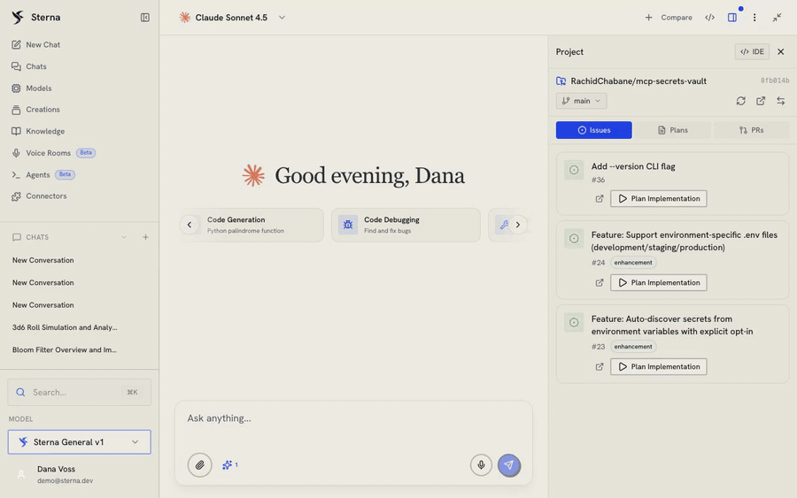
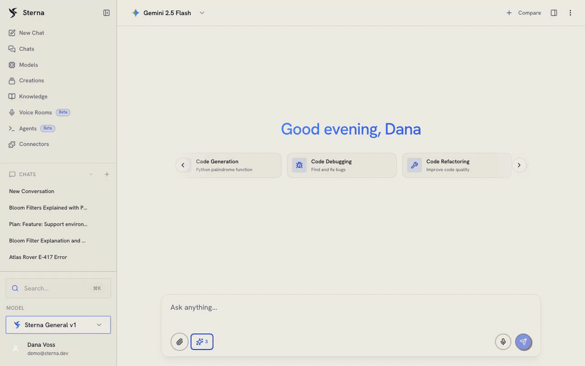
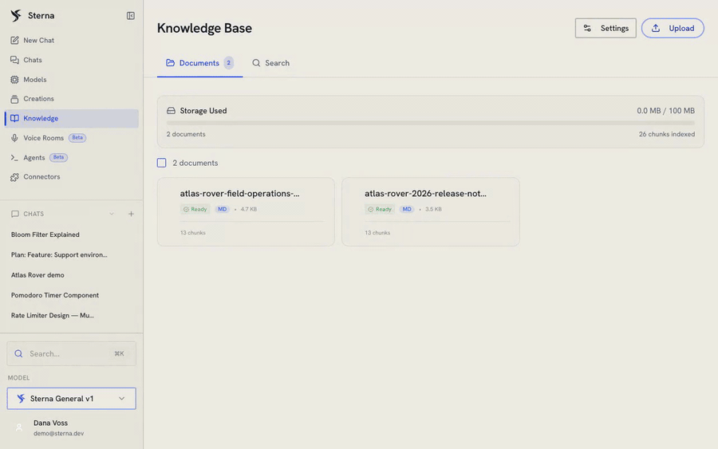
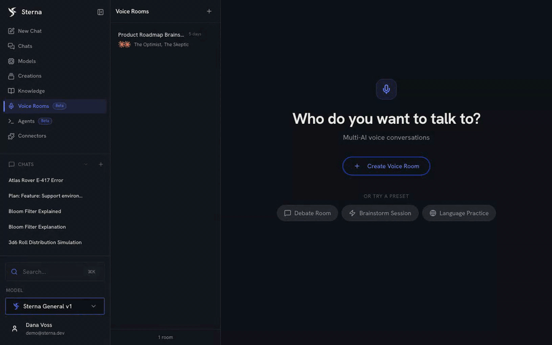
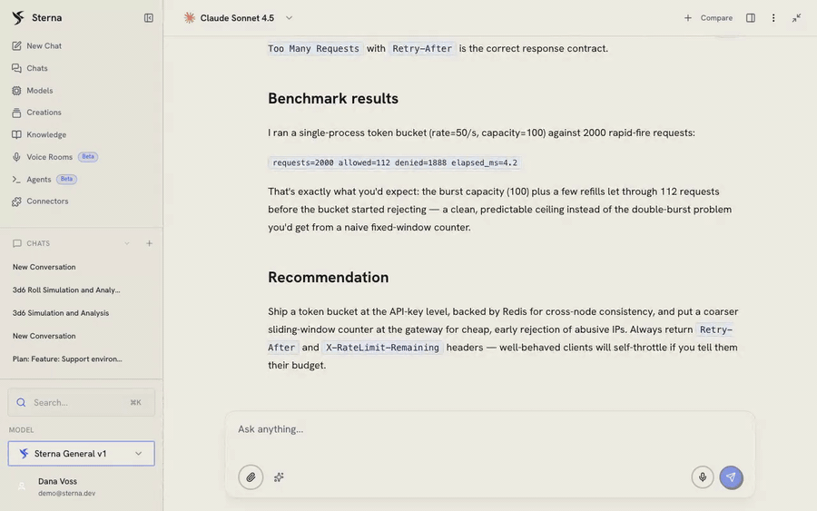

# Feature demos

Recorded against a running Sterna instance with a demo account. Nothing here is
mocked or storyboarded: every model call, tool call, sandbox execution and voice
turn in these clips is real. The short tour on the [README](../README.md) is the
condensed version; each clip below shows one capability end to end.

Each GIF is silent and loops. The source `.mp4` masters are 1280x800 and are not
committed to the repository; each clip links its mp4 master from the [v0.1.0 release](https://github.com/RachidChabane/sterna/releases/tag/v0.1.0).

---

## Issue to plan

The Project panel lists the open GitHub issues of a cloned repository. Clicking
**Plan Implementation** on issue #36 ("Add `--version` CLI flag") hands the issue
to the coding agent, which explores the repository in read-only plan mode inside
its sandbox. The Plans tab then holds the plan it wrote — summary, numbered steps
and the source issue — behind an **Implement Plan** button.

[Watch the mp4 version](https://github.com/RachidChabane/sterna/releases/download/v0.1.0/issue-to-plan.mp4) (sharper, seekable).

---

## Reasoning, code execution and image generation

One chat on Gemini 2.5 Flash with three features enabled at once. The model
reasons through the problem in visible sections, runs Python in the Docker
sandbox — 10,000 3d6 rolls, a text histogram, mean and standard deviation, back
in 0.33s — and then generates an image, priced and timed like every other call.

This is the one clip in the suite that is edited: two idle stretches are sped up
and one page reload is cut out. The reasoning, the tool calls and their outputs
are a single unedited session.

[Watch the mp4 version](https://github.com/RachidChabane/sterna/releases/download/v0.1.0/multimodal-tools.mp4) (sharper, seekable).

---

## Knowledge base

Two documents indexed into 26 chunks, with retrieval settings exposed
(similarity threshold, results per query). A question asked in chat is answered
from those documents: the answer cites the file it came from, and the retrieved
chunks are listed with their match scores and can be expanded to the exact text
the model was given.

[Watch the mp4 version](https://github.com/RachidChabane/sterna/releases/download/v0.1.0/knowledge-base.mp4) (sharper, seekable).

---

## Live voice room

Two AI personas with their own models and voices join a live room. A spoken
question is transcribed by streaming STT, an LLM router picks who answers, each
agent replies out loud with word-synced captions, and the session's transcript
is persisted to the room when it ends.

The GIF is silent. **The `.mp4` master of this demo carries the session's own
synthesized speech** — it is the only clip in the suite with an audio track,
and the only one recorded in dark mode, as voice rooms tend to be used.

[Watch the mp4 version](https://github.com/RachidChabane/sterna/releases/download/v0.1.0/voice-room-live.mp4) (sharper, seekable). Includes the session's real synthesized speech.

---

## Single chat and cost accounting

A new chat, one question, a streaming answer with reasoning and a runnable code
block — and then the part that matters: the per-message breakdown showing
measured latency, prompt and completion tokens, and what that single message
cost. Every message in Sterna carries this.

[Watch the mp4 version](https://github.com/RachidChabane/sterna/releases/download/v0.1.0/single-chat.mp4) (sharper, seekable).
